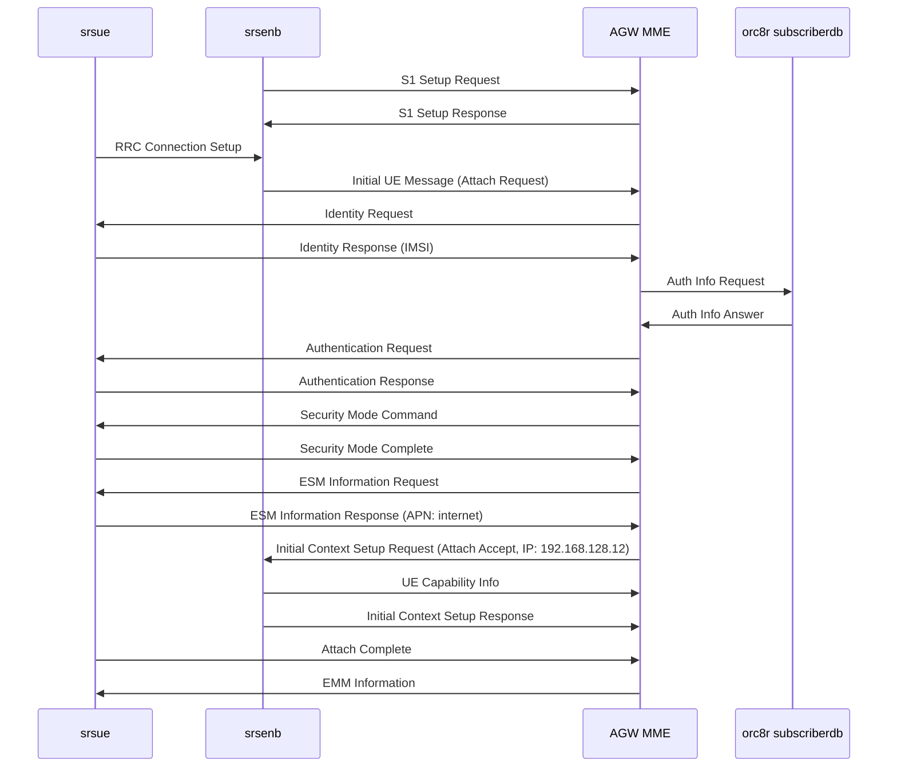

# LTE Attach Test with srsRAN on Magma AGW

Tested a 4G LTE attach using srsRAN (UE + eNB simulator) against the Magma AGW, with the AGW connected to orc8r on Minikube. Captured the registration flow with Wireshark.

---

## 1. Setup

srsRAN 4G was built and installed on the AGW VM itself. srsenb (eNB simulator) connects to the AGW's MME via S1AP/SCTP on `127.0.0.1:36412`. srsue (UE simulator) connects to srsenb over ZMQ virtual radio (TCP sockets replacing real radio hardware). From the AGW's perspective, the S1 connection looks identical to a real eNodeB.

```
srsue --ZMQ--> srsenb --S1AP/SCTP--> AGW (MME) --gRPC--> orc8r (subscriberdb)
```

The test used MCC/MNC `001/01` and TAC `1` (matching the LTE network config in orc8r). A subscriber was added via the orc8r API with IMSI `001010000000001` and test auth keys, then verified as synced to the AGW with `subscriber_cli.py get`.

## 2. Result

```
Found PLMN:  Id=00101, TAC=1
RRC Connected
Random Access Complete.     c-rnti=0x46, ta=0
Network attach successful. IP: 192.168.128.12
```

## 3. Captured Messages

Captured with `tcpdump -i lo -w lte_attach.pcap sctp`, filtered in Wireshark with `s1ap || nas-eps`.

| # | Message | Direction | What it does |
| --- | --- | --- | --- |
| 1 | S1 Setup Request | eNB → MME | eNB announces itself (PLMN, TAC) |
| 2 | S1 Setup Response | MME → eNB | MME accepts the eNB |
| 3 | Initial UE Message (Attach Request) | UE → MME | UE sends IMSI, asks to connect |
| 4 | Identity Request | MME → UE | MME asks UE to confirm identity |
| 5 | Identity Response | UE → MME | UE sends IMSI |
| 6 | Authentication Request | MME → UE | MME sends crypto challenge (RAND + AUTN) |
| 7 | Authentication Response | UE → MME | UE solves the challenge (RES) |
| 8 | Security Mode Command | MME → UE | MME sets encryption/integrity algorithms |
| 9 | Security Mode Complete | UE → MME | UE confirms, traffic is now encrypted |
| 10 | ESM Information Request | MME → UE | MME asks for APN details |
| 11 | ESM Information Response | UE → MME | UE sends APN name ("internet") |
| 12 | Initial Context Setup Request (Attach Accept) | MME → eNB | MME assigns IP, sets up bearer |
| 13 | UE Capability Info Indication | eNB → MME | eNB forwards UE radio capabilities |
| 14 | Initial Context Setup Response + Attach Complete | UE → MME | Attach done, bearer active |
| 15 | EMM Information | MME → UE | MME sends network name and time |

## 4. Sequence Diagram



## 5. Wireshark Trace

The pcap file is available [here](https://github.com/AmraniCh/magma-lfx-mentorship-notes/blob/main/delivrables/lte_attach.pcap).