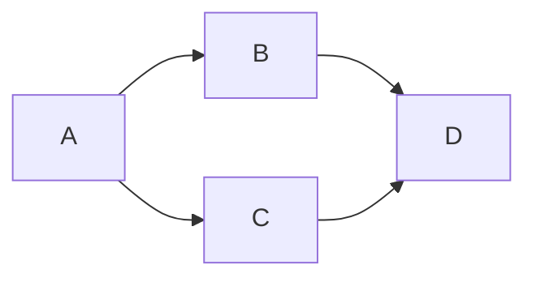

# Notes

## 1. What is Magma

- Magma is an open source platform that gives network operators an open, flexible and extendable mobile core network solution.
- Magma is a collection of software that makes running things like a **cellular** network affordable and customizable.

## 2. Magma Components

### 2.1 Access Gateway (AGW)

- AGW provides network services and policy enforcement.
- **Where is it?** Physically near the cell towers (antennas) in a city, village, or building.
- **What does it do?** It's the component that **directly handles your phone's connection**.

**Technically:**

- Runs on a physical machine (commodity hardware) close to the antennas
- Replaces what proprietary vendors like Ericsson/Nokia sell for hundreds of thousands of dollars
- Implements the EPC (Evolved Packet Core) for 4G LTE

### 2.2 Orc8r — Orchestrator

- **Where is it?** In the cloud (AWS, Azure, GCP, etc.). Centralized.
- **What does it do?** It **manages all the AGWs scattered around the world** from a single point.

**Technically:**

- Exposes a **REST API** (OpenAPI/Swagger) for administrators
- Communicates with AGWs via **gRPC**
- Can be hosted on a public or private cloud

### 2.3 FeG — Federation Gateway

- **Where is it?** Between Magma and a traditional operator's network (Orange, Maroc Telecom, Vodafone, etc.).
- **What does it do?** It **translates between Magma and the legacy mobile operator world**.

**Technically:**

- Uses standard **3GPP protocols** (the global mobile telecom standard)
- Lets Magma communicate with traditional MNOs (Mobile Network Operators)
- Useful for hybrid scenarios and federation between operators

```
                ┌─────────────────────┐
                │      Orc8r          │
                │  (Orchestrator)     │
                │  Web Dashboard      │
                │  REST API + gRPC    │
                └──────────┬──────────┘
                           │
              ┌────────────┼────────────┐
              │            │            │
              ▼            ▼            ▼
          ┌──────┐     ┌──────┐     ┌──────┐
          │ AGW1 │     │ AGW2 │     │ AGW3 │
          │(Rabat)│    │(Tanger)│    │ (Fès)│
          └──┬───┘     └──┬───┘     └──┬───┘
             │            │            │
             │ 📡         │ 📡         │ 📡
             ▼            ▼            ▼
          📱 📱        📱 📱        📱 📱
        (subscribers)


              ┌───────────────────┐
              │       FeG         │
              │ (Federation       │
              │  Gateway)         │
              └────────┬──────────┘
                       │
                       ▼
              ┌───────────────────┐
              │  Maroc Telecom    │
              │  (traditional MNO)│
              └───────────────────┘
```

## 3. Magma Community Structure & Governance

The Magma community is organized into **two main layers**: the people who maintain the code, and the governance bodies that steer the project.

### 3.1 Layer 1 — Magma Maintainers (the technical people)

**Codeowners / Approvers** are the people who maintain specific parts of the project. They're also **voting members** of Magma's governance.

- Code ownership is tracked in a file called **CODEOWNERS** in the repo.
- Each part of the codebase has its own "approvers team" (e.g., `approvers-sessiond` for the sessiond service).

#### How to become a Codeowner

1. Post in the `#governance-codeowners` Slack channel: *"I'd like to be considered as a Magma codeowner for component XXX."*
2. An existing codeowner nominates you with a template listing your contributions.
3. A **1-week vote** happens — existing team members vote Yes or No.
4. Majority "Yes" → you join the approvers team.

#### Desired qualities to become a Codeowner

- Solid contribution history (example: 7+ PRs merged)
- Solid code review history (example: 10+ code reviews)
- Demonstrated ownership of a specific component
- Technical leadership (driving design, writing design docs)

> Note: these aren't strict requirements — they explicitly welcome anyone interested in supporting the project to reach out.

### 3.2 Layer 2 — Governance Bodies

#### 1. Technical Steering Committee (TSC)

- Oversees the **technical direction** of the project.
- Provides guidance to keep the ecosystem balanced and sustainable.
- Operates under the **Technical Charter** of the Magma Core Foundation.

#### 2. Outreach Committee

- Focuses on **increasing awareness** of Magma.
- Works on **diversifying the contributor base** (recruiting new people — this is the body relevant to LFX mentees like you).

### 3.3 The full hierarchy (simplified)

```
        TSC (technical direction, ~5 members)
                    ↑
        Codeowners / Approvers (maintain components, vote)
                    ↑
        Committers (can merge code)
                    ↑
        Contributors (submit PRs, code merged in last 12 months)
                    ↑
        Newcomers / Mentees  ← YOU ARE HERE
```

### 3.4 What this means for your mentorship

| Your situation                              | The path forward                                                 |
| ------------------------------------------- | ---------------------------------------------------------------- |
| You start as a **mentee/newcomer**          | Submit your first PR (Deliverable #4) → become a **Contributor** |
| The realistic goal for a 3-month mentorship | Reach **Contributor** status (1+ merged PR)                      |
| The long-term goal (if you continue)        | Build toward **Codeowner** with 7+ PRs and 10+ reviews           |

**Key takeaway:** The governance is **merit-based and welcoming**. You climb by contributing consistently (code, reviews, docs). Even your "fix broken Slack links" contribution puts you on the bottom rung of this ladder.

**Useful channel to remember:** `#governance-codeowners` is where the maintainer nominations happen — good to know exists, but not where you start.

## 4. Magma Releases

Magma's releases are community-driven and split into two categories, following a structured process from development to publication.

### 4.1 Release Categories

- **Major releases** (e.g., 1.2.0, 1.3.0): Include planned features and come with an in-depth test report.
- **Minor releases** (e.g., 1.3.1, 1.3.2): Mainly for bug fixes and small content updates. Some "new" features may slip in if they weren't ready when the major release was cut.

Release notes (test reports, key features, known issues, bug fixes, logs, source code) are published on the GitHub Releases page.

### 4.2 Release Process

The process is **community-driven** and based on contributors' needs.

- Each release is **led by one organization** — ideally the group with the largest code contribution for that version.
- That organization plans the features, timelines, and communication.
- Before a release candidate is cut, the community must ensure `master` is healthy. After that, no new code is added.

A release candidate goes through **three main phases**:

1. **Development** — code creation, pull requests, CI checks.
2. **Validation** — system integration testing, performance testing, stability testing.
3. **Release** — tagging, build creation, communication to the community.

If the candidate passes all phases, it becomes an official release. If issues are found, they're fixed on `master` to restore health before cutting a new candidate.

> Releases should happen **quarterly or sooner** to minimize testing effort. Minor releases can be done over a few weeks.

### 4.3 Planning Documents

1. **Release Planning Template** — Aggregates features under development and aligns on which subset goes into the next release. Includes a timeline tab for milestone dates.
2. **Release Tracker** — Tracks the status of selected features (project management + visibility). Issues are tracked in a separate tab. Reviewed during the weekly release meeting.
3. **Release Reports** — Shares the features and changes for the release, including test reports, install scripts/logs, critical bug fixes, and key improvements.

### 4.4 Technical Release Process (high level)

> Note: the documentation is loosely based on the 1.8.0 release and assumes the AGW is built with Bazel. Some parts may need adapting for newer releases.

The general idea: create a release branch, publish artifacts to the artifactory **test** repositories, test them, then promote them to **production** repositories.

#### Main steps

1. **Create the release branch** — Apply a merge freeze on `master`, create and push a `v1.x` branch, then lift the freeze.
2. **Create third-party artifacts** — Build and push dependencies and Open vSwitch artifacts to the test repository (only `approvers-ci` members can run these workflows manually).
3. **PR on release branch vs backporting** — Changes only for the release branch go via a PR to that branch; changes also needed on `master` follow the backporting process.
4. **Change endpoints** — Pin Docker images (from `latest` to a specific tag) and switch `focal-ci` to `focal-1.x.0` across workflows, Dockerfiles, VMs, and Helm charts.
5. **Verify artifacts** — Confirm packages, Docker images, and Helm charts are pushed to the artifactory.
6. **Testing** — All CI workflows should pass (integration tests can be flaky and may need restarts). New features should have automated tests plus manual verification.
7. **Release** — Tag the head of the release branch as `v1.x.0` (the tag must not be moved), then promote artifacts from test to prod repositories via dedicated workflows.

#### Post-release steps

- Cut the docs for the `1.x` release on `master`.
- Bump development artifacts on `master` to the next version (e.g., after 1.9.0, build for 1.10.0).

### 4.5 Hot Fixes vs Backporting

- A **hot fix release** (`1.x.1`) is only needed if the released artifacts themselves need fixing — this requires the full process again, using `1.x.1`, `1.x.2`, etc.
- If artifacts aren't affected, it's enough to make changes directly on the release branch or backport them.

### 4.6 Troubleshooting & Improvements

- **Troubleshooting:** Wrong or damaged published artifacts should be removed by coordinating with LF support via the `#questions-to-linux-foundation-it` Slack channel.
- **Improvements:** The team wants to streamline the process — model more parts as CI workflows, pipeline existing workflows, reduce complexity, and stabilize tests. The long-term goal: a "one-click release."

### 4.7 What this means for your mentorship

| Aspect                                    | Relevance to you                                                                                                |
| ----------------------------------------- | --------------------------------------------------------------------------------------------------------------- |
| Major vs minor releases                   | Helps you understand which version to deploy (Deliverable #2) — pick a stable major release like the latest 1.x |
| The 3 phases (Dev / Validation / Release) | Shows where your contributions fit — your PRs land in the "Development" phase                                   |
| Quarterly cadence                         | Sets expectations: don't expect a new release during your short mentorship                                      |
| CI workflows & artifactory                | Directly tied to Deliverable #5 if you choose the "CI Workflow" improvement option                              |
| Bazel build system                        | Worth learning early — the AGW is built with Bazel, which affects your C++ debugging (Deliverable #4)           |

## 5. Communication Tools and Processes

This section describes the tools, channels, and processes the Magma community uses to stay in touch and discuss project matters. The key idea: **different communication channels serve different purposes** — pick the right one for the right type of message.

### 5.1 Magma Meetings

- All meetings are listed in the community Google Calendar.
- **Anyone is welcome** to drop in, listen to the discussions, or ask their own questions and start participating.
- Most meetings have **meeting notes** linked in the calendar — you can even add your own agenda items if you want a topic discussed.

### 5.2 Technical Steering Committee (TSC) Meetings

This is a special regular meeting tied to the project's governance. You might attend the TSC meeting to:

- Get help or attention on an outstanding **Magma Proposal**
- Ask questions or raise concerns generally
- Listen in on others discussing proposals, governance votes, etc.

### 5.3 Slack (synchronous communication)

Slack is the **main platform for real-time (synchronous) communication** between contributors. It's preferred for:

- One-to-one or small sub-group messages between team members and CODEOWNERS
- Sub-project status and coordination channels
- Quick, informal, "throwaway" messages
- Reaching CODEOWNERS via the `#governance-codeowners` channel
- Reaching the TSC via the `#governance-tsc` channel

**Important limitation:** Slack is **not durable or searchable**, so some topics should move OFF Slack after a quick initial chat:

- Detailed bug discussions → GitHub Issues or GitHub Discussions
- Proposals and design docs → the formal Proposal Process

> To create a Slack account, follow the "Accounts Setup" wiki page.

### 5.4 GitHub Issues

Used for tracked, actionable work:

- Tracking and fixing bugs
- Tying Pull Requests to specific tracked efforts
- The change Proposal Process

### 5.5 GitHub Discussions

A good **starting point for questions** — more durable and searchable than Slack. Use it to:

- Search for an existing answer to your problem, or post a new question
- Float an idea for a change before starting the formal Proposal Process (check for related historical discussions first)

> This is exactly the channel where you posted your Slack invite request (Discussion #15818).

### 5.6 Mailing Lists

- **magma-dev** — for technical discussions
- **magma-announce** — for announcements

### 5.7 Quick reference: which channel for what?

| If you want to...                       | Use...                                                   |
| --------------------------------------- | -------------------------------------------------------- |
| Send a quick, informal message          | **Slack**                                                |
| Reach a CODEOWNER or the TSC directly   | **Slack** (`#governance-codeowners` / `#governance-tsc`) |
| Report or discuss a bug in detail       | **GitHub Issues**                                        |
| Ask a question or float an idea         | **GitHub Discussions**                                   |
| Propose a formal change                 | **Proposal Process** (starts in Discussions)             |
| Follow technical conversations by email | **magma-dev** mailing list                               |
| Get official announcements              | **magma-announce** mailing list                          |
| Discuss live / get help on a proposal   | **Meetings** (esp. TSC)                                  |

### 5.8 What this means for your mentorship

- **Slack** = your daily home base (`#new-to-magma` for intros, plus coordination channels). Good for quick questions to mentors.
- **GitHub Discussions** = where you already requested the Slack invite — use it for questions that deserve a searchable, lasting answer.
- **GitHub Issues** = where you'll find bugs to fix for **Deliverable #4**, and where you'll tie your Pull Requests.
- **Key principle to follow:** don't bury important technical discussions in Slack (they get lost). Move detailed bug talk to Issues and ideas to Discussions — maintainers will respect that you understand the right channel for each message.

## 6. Tools

> Not all tools are necessary — some are duplicates and depend on contributor preference or Magma subsystem team support.

| Tool                   | Purpose                                                                                                                                      |
| ---------------------- | -------------------------------------------------------------------------------------------------------------------------------------------- |
| **Docker**             | Containerization — used to build developer containers for building/testing Magma code, and for CI (Continuous Integration) build/test phases |
| **Docusaurus**         | Documentation tooling used by Magma for versioned docs tied to releases                                                                      |
| **GitHub Actions**     | Main tooling for CI (Continuous Integration) workflows (not all, but the bulk)                                                               |
| **GitHub Codespaces**  | Spin up a Magma-custom dev environment in your browser — requires Magma GitHub org membership                                                |
| **Gitpod**             | Alternative browser-based dev environment — 40 hours/month free for open source projects                                                     |
| **IntelliJ IDEA**      | Code/doc editing for C/C++, Python, Go, Markdown, etc.                                                                                       |
| **Sentry**             | Error monitoring — requires membership in the `lf-9c` Sentry organization                                                                    |
| **VirtualBox**         | Virtualization tool used for development or integration testing (e.g. LTE Integration Tests)                                                 |
| **Visual Studio Code** | Code/doc editing for C/C++, Python, Go, Markdown, etc.                                                                                       |

### 6.1 What this means for your mentorship

| Tool                           | Relevance to you                                                                            |
| ------------------------------ | ------------------------------------------------------------------------------------------- |
| **Docker**                     | You'll likely use it to build/run AGW (Access Gateway) components locally                   |
| **GitHub Actions**             | Directly relevant to Deliverable #5 (CI workflow improvement option)                        |
| **GitHub Codespaces / Gitpod** | Quickest way to get a working Magma dev environment without local setup pain                |
| **VS Code / IntelliJ**         | Pick one for C++ and Python work on Deliverable #4                                          |
| **Sentry**                     | Useful for error monitoring if you work on bug fixes — request `lf-9c` org access if needed |

## 7. Accounts Setup

### 7.1 Slack

- Join the Magma workspace: http://slack.magmacore.org/

### 7.2 GitHub

- Create a GitHub account: https://github.com/signup
- Fork the Magma repo: https://github.com/magma/magma

### 7.3 Git Workflow

An opinionated workflow that simplifies Git by maintaining two branches per feature: `your_dev_branch` and `your_dev_branch_base`. This makes rebasing cleaner.

**Key commands:**

```bash
# Clone your fork and set upstream
git clone git@github.com:YOUR_USERNAME/magma.git && cd magma
git remote add upstream git@github.com:magma/magma.git

# Sync master with upstream and create a new dev branch
git-update YOUR_NEW_DEV_BRANCH

# Open a PR (single commit)
git open-pr

# Amend the commit and force-push to update the PR
git amend-pr

# Rebase PR onto master (or another branch)
git-rebase
git-rebase TARGET_BRANCH

# Useful inspection commands
git graph-all        # full commit graph
git diff-base        # diff between PR and trunk (master)
git diff-origin      # diff between local and remote dev branch

# Clean up all local branches when done
git delete-local-branches
```

### 7.4 Necessary Aliases

Add these to your `~/.gitconfig`:

```ini
[alias]
    delete-local-branches = !git branch | grep --invert-match master | xargs git branch --delete
    commit-amend = commit --signoff --amend --no-edit
    diff-base = !git diff $(git branch --show-current)_base
    diff-origin = !git diff origin/$(git branch --show-current)
    graph = graph-all --max-count=30
    graph-all = log --graph --all --format=format:'%C(auto)%h%C(reset) %C(cyan)(%cr)%C(reset)%C(auto)%d%C(reset) %s %C(dim white)- %an%C(reset)'
    amend-pr = !git add --all && git commit --signoff --amend --no-edit && git push --force
    open-pr = !git push-branch && git pull-request --browse
    push-branch = push --set-upstream origin HEAD
```

Add these to your shell rc file (`~/.bashrc` or `~/.zshrc`):

```bash
# Sync master with upstream, optionally create a new feature branch
function git-update() {
    git checkout master && git pull upstream master && git push origin master
    local br=${1}
    if [[ $br != "" ]]; then
        local br_base=${br}_base
        git branch ${br_base}
        git checkout -b ${br}
    fi
}

# Rebase current branch onto master or a specified target
function git-rebase() {
    local to=${1:-master}
    local args=${@:2}
    local br=$(git branch --show-current)
    local br_base=${br}_base
    echo "${to} ${br} ${br_base}" > ~/.gitrebase
    git rebase --onto ${to} ${br_base} ${br} ${args} && git checkout ${br_base} && git reset --hard ${to} && git checkout ${br}
}

# Complete a rebase after resolving merge conflicts
function git-rebase-finish() {
    local vals
    read -r -a vals < ~/.gitrebase
    local to=${vals[0]}; local br=${vals[1]}; local br_base=${vals[2]}
    git checkout ${br_base} && git reset --hard ${to} && git checkout ${br}
}
```

## 8. Report, Track and Fix Bugs

### 8.1 Reporting a Bug

1. Ensure the bug is **reproducible**.
2. Search if it **already exists** in [GitHub Issues](https://github.com/magma/magma/issues).
   - If it does → leave a 👍 to signal you're affected. **Do not comment "me too"** — only comment if you have meaningful new information.
3. If it doesn't exist → create a new [**Bug report**](https://github.com/magma/magma/issues/new/choose) issue.

> If the bug has a **security impact**, follow the [Security Overview for Contributors](https://github.com/magma/magma/wiki/Security-Overview-for-Contributors) instead.

### 8.2 Tracking a Bug

All information about an issue is on its GitHub issue page. See the [official GitHub Issues docs](https://docs.github.com/en/issues/tracking-your-work-with-issues/about-issues) for more.

### 8.3 Fixing a Bug

- You can fix **any open issue that has no assignee**.
- If the issue already has an assignee → contact that person first via the [Communication Tools](https://github.com/magma/magma/wiki/Communication-Tools-and-Processes).

### 8.4 What this means for your mentorship

| Step                               | Action                                                                                                        |
| ---------------------------------- | ------------------------------------------------------------------------------------------------------------- |
| Find a bug to fix (Deliverable #4) | Browse open issues with no assignee at [github.com/magma/magma/issues](https://github.com/magma/magma/issues) |
| Claim it                           | Leave a comment saying you'd like to work on it                                                               |
| Fix it                             | Open a PR linked to that issue                                                                                |
| Rule to remember                   | Never comment "me too" — use 👍 instead                                                                       |

## 9. Adding and Tracking Proposals

A **proposal** is a formal suggestion to change something in the Magma project — can be a process update, an architectural change, or anything else. Any size is welcome.

### 9.1 Proposal Lifecycle

```
Contributor creates Issue (label: `type: proposal`)
        ↓
Public discussion with TSC
        ↓
    ┌───────────────────────────────┐
    │                               │
accepted                      needs design doc
(label: `status: accepted`)        │
    │                        Write design doc (PR)
    ↓                              │
 Close issue              Community feedback
                                   │
                           Back to TSC discussion
                                   │
                           accepted / rejected / withdrawn
                                   │
                              Close issue
```

- **Withdrawn** = the author themselves decided to cancel the proposal.
- **Rejected** = TSC voted against it.
- **Accepted** = majority TSC vote in favor.

### 9.2 How to Submit a Proposal

1. Open a [GitHub Issue](https://github.com/magma/magma/issues/new/choose) using the **"Proposal"** template.
2. Keep it **clear and concise** — aim for a "one-pager" style.
3. Optionally add a **component label** (e.g. `component: AGW`) to help the TSC identify the right domain experts.
4. The TSC discusses it via:
   - TSC meeting
   - `#governance-tsc` Slack channel
   - `magma-tsc-voting@lists.magmacore.org`

### 9.3 Possible Outcomes (via labels)

| Label                      | Meaning                                                 |
| -------------------------- | ------------------------------------------------------- |
| `status: accepted`         | Proposal approved — define next steps                   |
| `status: rejected`         | TSC voted against it                                    |
| `status: withdrawn`        | Author cancelled the proposal                           |
| `status: needs design doc` | Nominally accepted but needs a detailed design document |

### 9.4 Design Doc (if required)

- Can start as a Google Doc or Quip Doc.
- Must eventually be submitted as a **PR** to `docs/readmes/proposals/`.
- PR review = grammar/formatting only — content discussion stays on the GitHub Issue.
- Follow the [Google Design Doc template](https://www.industrialempathy.com/posts/design-docs-at-google/) as a reference.

### 9.5 Tracking

- All proposals are GitHub Issues labeled [`type: proposal`](https://github.com/magma/magma/issues?q=is%3Aissue+label%3A%22type%3A+proposal%22).
- Tracked via the [Proposal Tracker](https://github.com/orgs/magma/projects/26/views/1) GitHub Project.
- Closed proposals remain discoverable for historical reference.
- The `#proposals` Slack channel gets notified when new proposals are created.

### 9.6 What this means for your mentorship

> As a mentee, you will likely **never need to submit a proposal**. Your work (bug fix PR = Deliverable #4) doesn't require one. This process is for contributors who want to **change how Magma works** at a design or process level.
> 
> Good to know it exists — especially if you later want to propose a CI improvement (Deliverable #5).

## 10. Contributing Code

### 10.1 Development Environment

Two IDEs (Integrated Development Environments) are supported:

| IDE                             | Setup                                                                     |
| ------------------------------- | ------------------------------------------------------------------------- |
| **IntelliJ IDEA**               | Works well with the Virtual Machine (VM) setup                            |
| **Visual Studio Code (VSCode)** | Works well with the devcontainer setup — locally or via GitHub Codespaces |

### 10.2 Where to Start

- Browse issues labeled [`good first issue`](https://github.com/magma/magma/labels/good%20first%20issue) on GitHub.
- Join the Slack `#general` channel and say hello — maintainers can point you to a good starter task.
- Also check the [Docusaurus documentation](https://docs.magmacore.org/docs/next/basics/introduction.html) as a reference.

### 10.3 Development Workflow

Magma uses the standard **fork and pull-request** workflow:

```
Fork the repo → Create a branch → Make changes → Open a PR → Pass CI → Get approval → Add `ready2merge` label → Maintainer merges
```

### 10.4 PR & Commit Requirements

#### Required

**1. Signed-off commits**

Every commit must be signed off to certify you have the right to contribute the code:

```bash
git commit -s -m "fix(agw): Fix pyroute2 dependency"
# Adds automatically: Signed-off-by: Your Name <your@email.com>
```

Your real name is required — no pseudonyms.

**2. Conventional Commits format**

PR title and commit message must follow the format:

```
type(scope): Title
```

Examples:

- `fix(agw): Fix pyroute2 dependency`
- `feat(orc8r): Add new subscriber API`
- `docs(nms): Update setup instructions`

Supported types and scopes are defined in [`.github/workflows/semantic-pr.yml`](https://github.com/magma/magma/blob/master/.github/workflows/semantic-pr.yml).

**3. Breaking change label**

If your PR breaks backward compatibility (e.g. requires a data migration, or breaks AGW ↔ Orc8r interface), add the [`breaking change`](https://github.com/magma/magma/issues?q=label%3A%22breaking+change%22) label.

#### Recommended

- **Test plan**: for non-trivial PRs, describe the manual verification steps you took.
- **Imperative mood** in PR title and description — mentally prepend *"This commit will..."* to check. Example: "Fix null pointer in sessiond" ✅ vs "Fixed null pointer" ❌

### 10.5 Code Review Process

1. A codeowner is **automatically assigned** when you open a PR.
2. Use GitHub's **"Re-request Review"** button after addressing feedback — do NOT ping people on Slack directly.
3. Exception: if no response after **one week**, you may send a personal Slack message.
4. Once all required CI (Continuous Integration) checks pass and you have **at least one approval** → add the [`ready2merge`](https://github.com/magma/magma/labels/ready2merge) label.
5. A maintainer will then merge it.

### 10.6 CI/CD (Continuous Integration / Continuous Deployment)

When a PR is submitted, a suite of automated checks runs. **Required checks must pass** before merging.

You can see check results on the PR page, or via [GitHub Actions](https://github.com/magma/magma/actions) (filterable by branch/user), or using the GitHub CLI (`gh`).

**Useful `gh` commands:**

```bash
# List the last open PRs
gh pr list

# List all checks on a PR with results
gh pr checks some_remote:branch_name

# Same, filtered by required checks only
gh pr checks --required some_remote:branch_name

# List all workflows (including disabled ones)
gh workflow list -a

# See the full YAML definition of a workflow
gh workflow view "DP Lint & Test" --yaml

# Find which approver group owns a check
gh workflow view "DP Lint & Test" --yaml | grep "^# owner:"

# Get the purpose of a check
gh workflow view "DP Lint & Test" --yaml | grep "^# purpose:"

# Get remediation steps for a failing check
gh workflow view "DP Lint & Test" --yaml | grep "^# remediation:"
```

> If a check fails, leave a comment on the PR. If needed, mention the approver group that owns the check (found via `grep "^# owner:"` above).

**When to use `gh` commands in Magma:**

| Situation                                                    | Command                                                          |
| ------------------------------------------------------------ | ---------------------------------------------------------------- |
| Check if someone already has a PR for the same issue         | `gh pr list`                                                     |
| After opening your PR — check if CI is passing               | `gh pr checks your_remote:branch_name`                           |
| Check only the required checks (the ones that block merging) | `gh pr checks --required your_remote:branch_name`                |
| A CI check fails and you don't know who owns it              | `gh workflow view "check-name" --yaml \| grep "^# owner:"`       |
| Understand what a failing check does                         | `gh workflow view "check-name" --yaml \| grep "^# purpose:"`     |
| Get hints on how to fix a failing check                      | `gh workflow view "check-name" --yaml \| grep "^# remediation:"` |

> For your first contribution (Deliverable #4), you can do everything from the browser. The `gh` commands save time once you're managing multiple PRs.

Notable non-GitHub-Actions checks:

| Check               | Purpose                                                                                 |
| ------------------- | --------------------------------------------------------------------------------------- |
| `mergefreeze`       | Blocks merges during a code freeze (required)                                           |
| `Magma-OAI-Jenkins` | OAI's (OpenAirInterface's) MME (Mobility Management Entity) integration test (required) |
| `Codecov.io`        | Code coverage tracking (not required)                                                   |

### 10.7 Backporting to Release Branches

To apply a fix to an older release branch (e.g. `v1.8`):

1. Merge your PR to `master` first.
2. Add the label `apply-v1.8` (or the relevant branch) to the merged PR.
3. The `MagmaCIBot` automatically creates a backport PR.
4. Post the backport PR in `#magma-releases` Slack channel for release manager approval.
5. Once approved → merge.

> ⚠️ Docusaurus documentation is **never** backported.

### 10.8 What this means for your mentorship

| Step                  | Action                                                                                         |
| --------------------- | ---------------------------------------------------------------------------------------------- |
| Find a task           | Browse [`good first issue`](https://github.com/magma/magma/labels/good%20first%20issue) labels |
| Write your commit     | Use `git commit -s` and follow `type(scope): Title` format                                     |
| Open your PR          | Fork → branch → push → open PR on `magma/magma`                                                |
| After review feedback | Use "Re-request Review" — don't ping on Slack                                                  |
| Ready to merge        | Add `ready2merge` label after CI passes + approval                                             |
| Key rule              | One approval from the right codeowner + all required CI checks = mergeable                     |

## 11. Contributing Documentation

### 11.1 Overview

Magma's documentation is built with **Docusaurus** (a documentation site generator) and hosted at [docs.magmacore.org](https://docs.magmacore.org/). Any change merged to the `magma/magma` GitHub repo is automatically reflected on the website.

Documentation is **versioned per release** — each major/minor release gets its own doc version.

### 11.2 Documentation Structure

| Path                              | Purpose                                                          |
| --------------------------------- | ---------------------------------------------------------------- |
| `docs/readmes/`                   | Current (master) documentation — edit here for upcoming releases |
| `docs/docusaurus/versioned_docs/` | Versioned docs tied to past releases                             |
| `docs/docusaurus/sidebars.json`   | Controls which docs appear in the sidebar                        |
| `docs/docusaurus/siteConfig.js`   | Site-wide configuration (look and feel)                          |
| `docs/readmes/proposals/`         | Design documents submitted via the Proposal Process              |

### 11.3 Making Changes

| Action                   | What to do                                                                              |
| ------------------------ | --------------------------------------------------------------------------------------- |
| **Add a new doc**        | Add the file under `docs/readmes/`, then update `sidebars.json`                         |
| **Edit an existing doc** | Edit the file under `docs/readmes/`                                                     |
| **Edit a versioned doc** | Edit under `docs/docusaurus/versioned_docs/` — update the current doc first             |
| **Delete a doc**         | Remove from `docs/readmes/` and update `sidebars.json` — be careful with versioned docs |

> ⚠️ Docusaurus documentation is **never backported** to release branches.

> ⚠️ If a doc hasn't changed between versions, it won't appear in the newer version's folder — it inherits from the previous version. To edit it for a specific version only, copy it first from the older version folder.

### 11.4 Checking & Previewing Changes

```bash
# Check Markdown lint before pushing
cd ${MAGMA_ROOT}/docs && make precommit

# Auto-fix some lint issues
cd ${MAGMA_ROOT}/docs && make precommit_fix

# Preview changes locally in a browser
cd ${MAGMA_ROOT}/docs && make dev
```

> The `markdown-lint` CI check is **required** — your PR will fail if Markdown style rules are violated.

### 11.5 Diagrams

Use **Mermaid diagrams** instead of images whenever possible — both GitHub and Docusaurus support them natively.



### 11.6 Writing Conventions

- Write in **plain English** — short sentences, active verbs
- Use **"you"** and **"we"**
- Use **descriptive hyperlink text** — never use "here" as the link text
- Use **imperative mood** for titles: "Upgrade", "Deploy", "Debug"
- Use **long form** of CLI flags: `--deployment` not `-d`

**Consistent capitalization:**

| Term                      | Correct spelling |
| ------------------------- | ---------------- |
| Orchestrator              | Orc8r            |
| Network Management System | NMS              |
| Kubernetes                | K8s              |
| Remote Procedure Call     | gRPC             |
| Base Station              | eNodeB           |

**File naming example:**

| Doc           | Title                    | ID               | Filename                |
| ------------- | ------------------------ | ---------------- | ----------------------- |
| Upgrade guide | `Upgrade to v1.4`        | `upgrade_1_4`    | `lte/upgrade_1_4.md`    |
| Install guide | `Install Access Gateway` | `deploy_install` | `lte/deploy_install.md` |

### 11.7 Editing the GitHub Wiki

To edit the Magma Wiki (the pages you've been reading), you need to be a **member of the Magma GitHub organization** first. Once you are, an "Edit" button appears on each wiki page.

To add images to the Wiki:

1. Clone the Wiki repo
2. Place images in `assets/page-name/image-name.png`
3. Reference with: ``

### 11.8 Contributing a Blog Post

The Magma website welcomes community blog posts. Ideas: deployment case studies, use cases, feature highlights, demos.

To submit → send your text and files to:

- Kendall Waters Perez: kperez@linuxfoundation.org
- Jill Lovato: jlovato@linuxfoundation.org

### 11.9 What this means for your mentorship

> As a mentee, documentation contributions are a **great low-barrier way to get started** — no complex C++ required.
> 
> - Fix a typo or unclear sentence → open a PR to `docs/readmes/`
> - It still counts as a contribution and puts you on the contributor ladder
> - Always run `make precommit` before pushing to avoid CI failures

## 12. Security Overview for Contributors

### 12.1 Reporting a Security Vulnerability

- **Regular bug** → open a GitHub Issue (public)
- **Security bug** → **never open a public issue** → report privately via security@magmacore.org

### 12.2 Getting Access (if you want to contribute to security)

Build your reputation first (fix `good first issues`), then request access to:

- Security repo: https://github.com/magma/security/
- Slack channel: `#security`
- Or email: security@magmacore.org

### 12.3 What this means for your mentorship

> Security work is not expected from you. The only rule: if you accidentally find a security bug — **do NOT open a public issue**, email security@magmacore.org instead.
